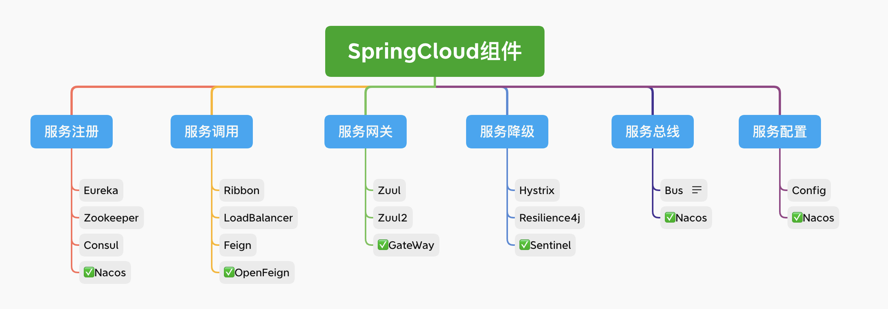

# SpringCLoud学习


* 微服务6大组件：
    * 服务注册、服务调用
    * 服务网关、限流/降级/熔断
    * 服务总线、服务配置

## 搭建
### 组件
#### Nacos
* [官方文档](https://nacos.io/zh-cn/docs/what-is-nacos.html)
* 作用：服务注册、服务总线、服务配置
* 基础配置部署
    1. 下载最新稳定版本，解压
    2. 单机模式启动`sh startup.sh -m standalone`
    3. 访问`http://ip:8848/nacos/`
#### Sentinel
* [参考文档](https://sentinelguard.io/zh-cn/docs/introduction.html)
* 作用：流量治理组件，从流量路由、流量控制、流量整形、熔断降级、系统自适应过载保护、热点流量防护等多个维度来帮助开发者保障微服务的稳定性
* 服务熔断时，与Hystrix的区别
  * 原则相同：当调用链路中某个资源出现不稳定，则对这个资源的调用进行限制，并让请求快速失败，避免影响到其它的资源，最终产生雪崩的效果
  * 手段上有区别：
    * Hystrix 通过线程池的方式，来对依赖(资源)进行了隔离，优点：彻底隔离，缺点：线程切换需要成本，需要预先给各个资源做线程池大小的分配
    * Sentinel：
      * 并发线程数进行限制
      * 响应时间对资源进行降级
* 基础配置部署
    * jar包下载
    * `java -jar sentinel-dashboard-1.8.6.jar`启动即可
    * 访问`http://ip:8080/`，用户名密码均为`sentinel`
### 服务
* 服务调用者
    * [pom.xml](../9Service_A/pom.xml)
    * 配置文件
        * resources目录下放置bootstrap.properties
            ```
            spring.cloud.nacos.server-addr=vUbuntu4:8848
            spring.application.name=serviceA
            ```
        * [真正的配置](../nacosConfig/serviceA.properties)交给nacos，配置在nacos配置列表中，`DataID`与服务名一致
    * 程序注解
        * [主启动类](../9Service_A/src/main/java/com/cl/learn/springcloudlearn0/server/ServiceA.java)
        * [动态刷新配置](../9Service_A/src/main/java/com/cl/learn/springcloudlearn0/server/config/MyConfig.java)
            * 必须要有@RefreshScope注解的类中注入的配置，才能动态刷新，feign相关配置需要重启才能生效
* 服务被调用者
* 服务网关

## 限流/降级/熔断测试
* 限流/降级/熔断
    * 服务限流（Rate Limiting）：服务限流是一种控制流量的策略，它确保服务在一定时间内只能处理限定数量的请求
    * 服务降级（Fallback）：服务降级是在服务不可用或性能下降时提供一个备用的响应或数据。
    * 服务熔断（Circuit Breaking）：服务熔断是一种容错机制，当服务出现异常或响应时间过长时，系统可以自动切断对该服务的访问，转而使用备用的响应或返回错误信息。
```
原地址访问：
    服务调用者：http://127.0.0.1:8901/A/m1
    服务被调用者：http://127.0.0.1:8902/B/m1
服务网关地址访问：
    服务调用者：http://127.0.0.1:8101/prefix/A/m1
    服务被调用者：http://127.0.0.1:8101/B/m1
```